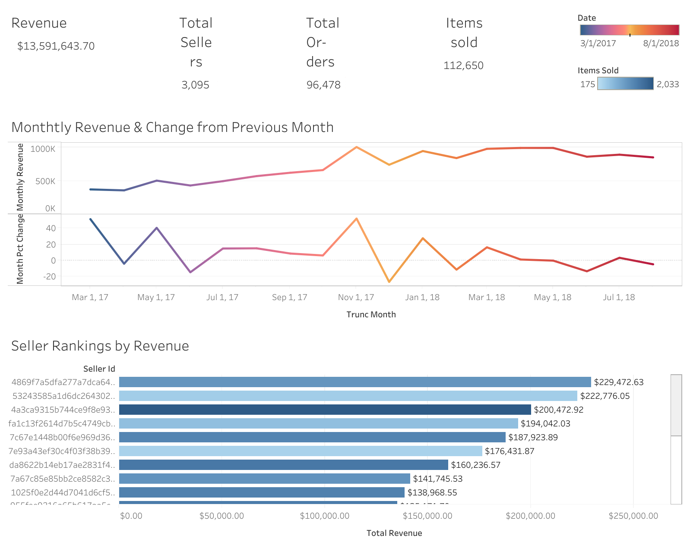
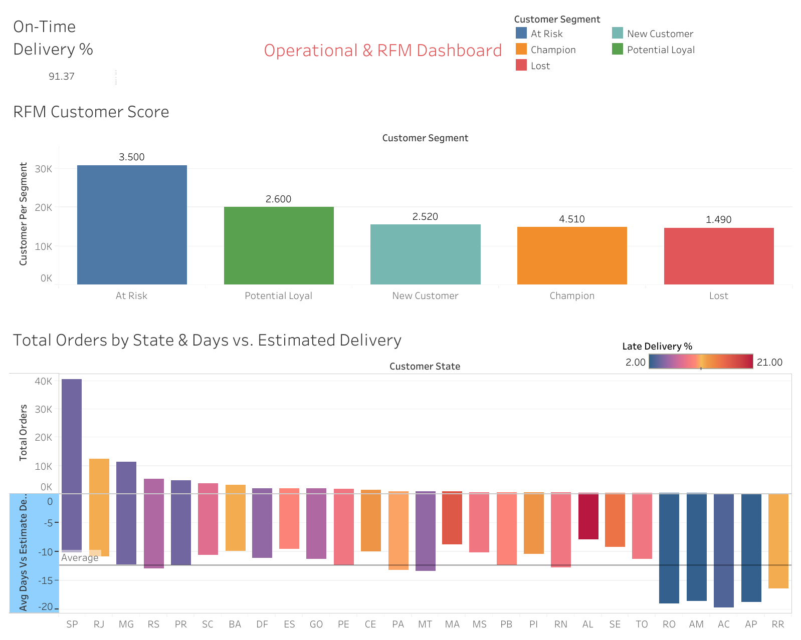

# Olist Order to Payment Analytics

### Author: Lucio Nieto 
### Date: 4/1/2026
### Contact: Lucionieto2.0@gmail.com | Linkedin (https://www.linkedin.com/in/lucio-nieto/) 

## Project Objective
Analyzed 100K+ from a real life Brazilian E-Commerce database of orders from 2016-2018 across an 8-table relational schema to uncover delivery performance bottlenecks, 
revenue trends, and customer retention risks. In this project data was extracted, transformed, staged and queried to create dashboards on Tableau public. 
Postgres SQL was used in the pipeline centered on consumer risk and sales performance. 
These queries where then visualized with custom KPI designed and implemented. 

## Tools & Techniques
### PostgreSQL, Tableau Public | SQL Techniques: CTEs, window functions (RANK, LAG, NTILE), CASE expressions, multi-table JOINs, staging → mart pipeline

## Data Structure 
---
olist-order-to-payment-analytics/
├── README.md
├── schema/
│   └── Create_tables.sql          # DDL + COPY commands for all 9 tables
├── sql/
│   ├── staging/                   # Staging views (cleaned column names, type casting)
│   └── marts/                     # Mart views (final analytical tables)
├── analysis/
│   ├── seller_rankings.sql        # Top sellers by revenue with RANK()
│   ├── monthly_revenue.sql        # MoM revenue trend with LAG()
│   ├── delivery_performance.sql   # Late delivery % by state with CASE
│   └── mart_customer_segments.sql # RFM segmentation with NTILE()
├── dashboard/
│   ├── sales.png                  # Sales & Revenue dashboard screenshot
│   └── operations.png             # Operations & RFM dashboard screenshot
└── docs/
    └── data_dictionary.md         # Column definitions & business context

---
## Data Schema

### Raw Tables

| Table | Primary Key | Description |
|-------|-------------|-------------|
| `orders` | order_id | Core order table with status and timestamps |
| `olist_customer_dataset` | customer_id | Customer info with unique_id, city, state |
| `order_items` | (order_id, order_item_id) | Line items per order with price, freight, seller |
| `order_payments` | (order_id, payment_sequential) | Payment method, installments, value per order |
| `order_reviews` | — | Review scores and comments per order |
| `products` | product_id | Product category, dimensions, weight |
| `seller`  | seller_id | Seller location (city, state, zip) |
| `geolocation` | — | Zip code to lat/lng mapping |
| `category_translation`| product_category_name | Portuguese to English category names |

###  Table Relationships

- `orders` → `olist_customer_dataset` 
- `orders` → `order_items`
- `orders` → `order_payments` 
- `orders` → `order_reviews` 
- `order_items` → `products`
- `order_items` → `seller`
- `products` → `category_translation`

## #Key Findings
### 1. Seller Rankings (`seller_rankings.sql`)
- **Technique:** CTE + RANK() window function
- **Analysis:** Top seller generated $229K in revenue across 1,156 items. The highest-volume seller (1,987 items) ranked #3 by revenue, showing that volume doesn't always equal highest revenue.

### 2. Monthly Revenue Trend (`monthly_revenue.sql`)
- **Technique:** CTE + LAG() window function + DATE_TRUNC
- **Analysis:** Revenue grew steadily from ~$370K/month in early 2017 to nearly $1M/month by late 2017, with month-over-month growth stabilizing around 5-15% through 2018. *A sharp drop in late 2018 likely reflects incomplete data*

### 3. Delivery Performance (`delivery_performance.sql`)
- **Technique:** CTE + CASE expression + aggregate functions
- **Analysis:** Overall on-time delivery rate is 91.37%. Alagoas (AL) has the worst late delivery rate at 21%, while most orders arrive an average of 10 days early. TO, RO and AM deliver earliest but have the lowest order volumes.

### 4. Customer RFM Segmentation (`mart_customer_segments.sql`)
- **Technique:** Chained CTEs + NTILE() window function + CASE expression
- **Analysis:** "At Risk" is the largest customer segment at 30,768 customers (32%), followed by "Potential Loyal" at 20,107. Only 14,808 customers qualify as "Champions." This suggests significant retention opportunity.

## Dashboards

### Sales & Revenue Dashboard


KPIs: Total Revenue ($13.59M), Total Items Sold (112,650), Total Sellers (3,095), Total Orders (96,478)

### Operations & RFM Dashboard


KPIs: On-Time Delivery Rate (91.37%), Customer segment distribution, Late delivery % by state

## How to Run

### Prerequisites
- PostgreSQL installed locally
- DBeaver or any SQL client
- Tableau Public (free) for dashboards

### Steps

1. **Create the database:**
   ```sql
   CREATE DATABASE olist;
   ```

2. **Download the dataset:** Get the [Brazilian E-Commerce Dataset by Olist](https://www.kaggle.com/datasets/olistbr/brazilian-ecommerce) from Kaggle

3. **Create tables and load data:** Run `schema/Create_tables.sql` — update the file paths in the COPY commands to match your local CSV location

4. **Create staging views:** Run the scripts in `sql/staging/`

5. **Create mart views:** Run the scripts in `sql/marts/`

6. **Run analysis queries:** Execute the scripts in `analysis/` to explore the data

7. **Dashboard:** Open Tableau Public and connect to the exported mart CSVs, or connect directly to your PostgreSQL database

---

## Dataset Source

[Brazilian E-Commerce Public Dataset by Olist](https://www.kaggle.com/datasets/olistbr/brazilian-ecommerce) — Kaggle

Real commercial data, anonymized. Company and partner references replaced with Game of Thrones house names.


